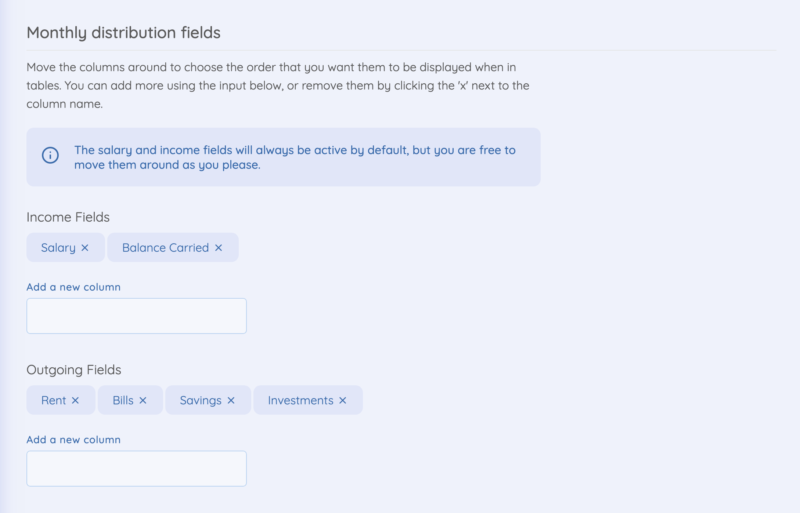

The monthly distribution section allows you to track where your money is going each month. The idea of this section is not to track every small transaction, but to log the large outgoings from your salary, and then working out how much money you have left to spend throughout the month.

## Creating a log

Head to the monthly distribution section and hit the '+' button to open the form to create a new log.

From there, you'll see a few fields. Every form will have a `Date`, `Income`, and `Balance carried from last month` field. The rest are configurable yourself in the [settings](#configuring-your-fields).

The calculations for this section work best if you log everything at the start of the month. This way, you can log the salary that you just received (at the end of the previous month), and then you can log the amount of cash carried over from the previous month (salary paid in minus the current balance in your account).

The rest of the fields will be whatever you have configured in the settings area. Once you've filled in these fields, your remaining disposable income will be displayed at the bottom of the form.

## Configuring your fields

To configure your monthly distribution fields, head to settings and scroll down to `Monthly distribution fields`. Here you'll find something looking like the image below:

- These item can be drag and dropped to be in the order that you want them to be in. This will determine the order that they appear on the form, and on the table.
- To delete an item, press the little 'x' on the item that you want to delete.
- You can add more fields by typing in your field name to the text input and hitting enter.
- Don't forget to hit the `Save changes` button when you're done!
